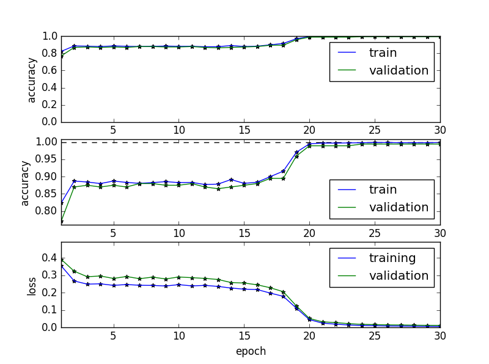
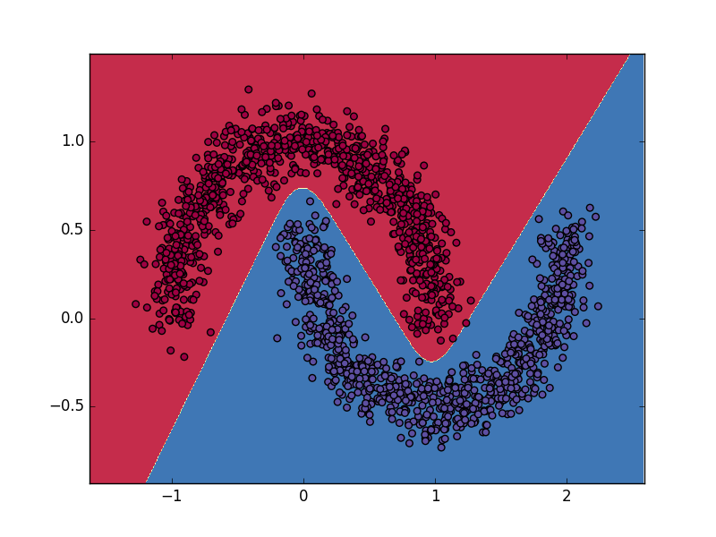

# 教程 Tutorials

本教程主要介绍Hamaa中的一些常见概念，
以及如何在1分钟内学会使用Hamaa搭建神经网络进行分类。

## Getting started: 1 minutes to Hamaa

在Hamaa中，一个神经网络模型被称为一个model，
其中最基础的一种model叫做`Sequential`，即由网络层按序列依次堆叠而成。

这是一个`Sequential`模型:

```python
from hamaa.models import Sequential

model = Sequential()
```

添加网络层只需使用`add()`:

```python
from hamaa.layers import Dense, Activation

model.add(Dense(input_dim=2, output_dim=4))
model.add(Activation('sigmoid'))
model.add(Dense(output_dim=2))
model.add(Activation('softmax'))
```

设置模型的目标(损失)函数以及优化器:

```python
from hamaa.optimizers import SGD

model.set_objective('categorical_crossentropy')
model.set_optimizer(SGD(lr=0.01, momentum=0.9))
```

打印模型的详细信息:

```python
print model.summary()
```


加载数据集（此处采用moons数据集，为两个半弧形组成）,并切分其中0.9作为训练集，剩下0.1作为验证集

```python
from hamaa.datasets import datasets
from hamaa.utils.np_utils import split_training_data

x, y = datasets.load_moons_data(nb_data=2000, noise=0.1)
training_data, validation_data = split_training_data(data=(x, y), split_ratio=0.9)
```

接下来就可以开始训练模型:

```python
model.train(training_data=training_data,
            nb_epochs=30,
            mini_batch_size=100,
            verbose=1,
            validation_data=validation_data,
            log_epoch=1)
```

训练信息如下图所示:


如果每个epoch耗时比较长，还可以使用进度条功能:


训练完之后评估模型的准确率:

```python
print model.evaluate_accuracy(x, y) 
```

如果你想直观地查看模型的训练/验证准确率与损失函数值随着训练周期的变化图，可以:
```python
model.plot_training_iteration()
```




最后，如果数据集是二维数据，那么还可以画出决策边界:

```python
model.plot_prediction(data=training_data)
```

